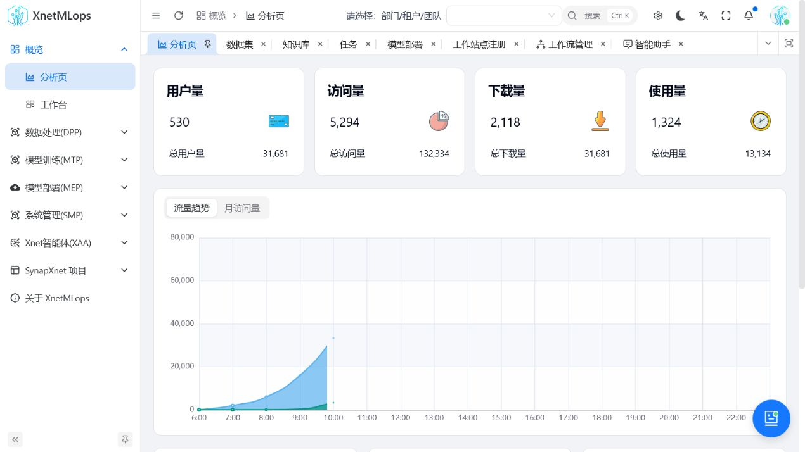
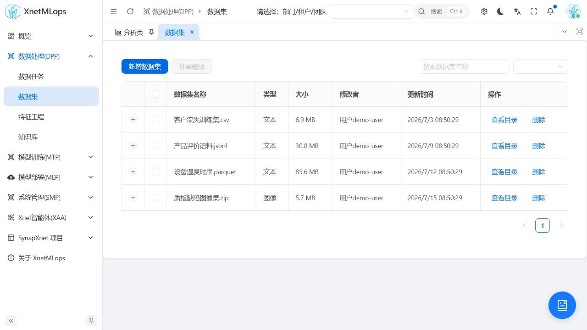
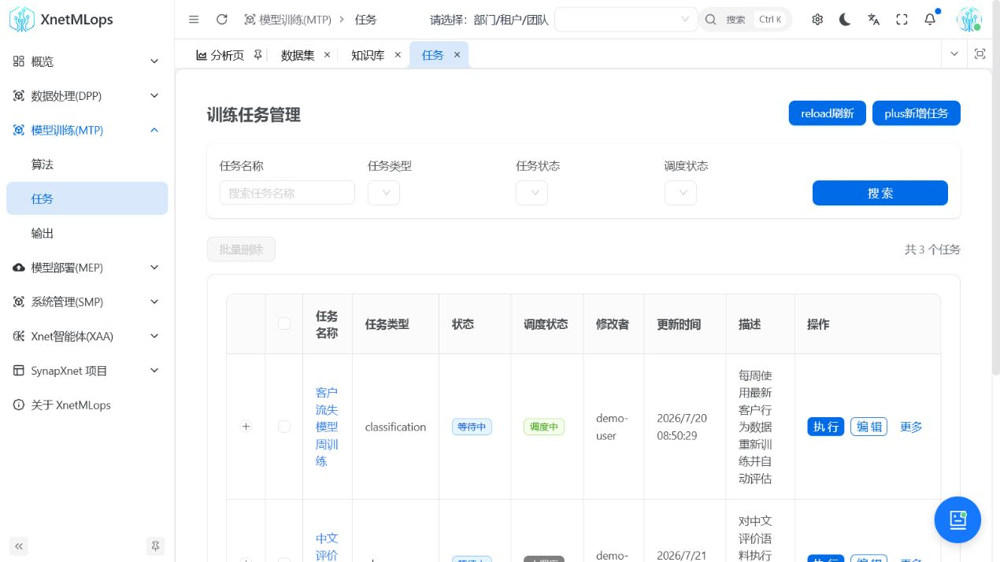
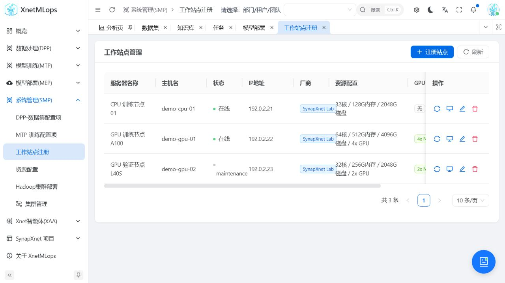
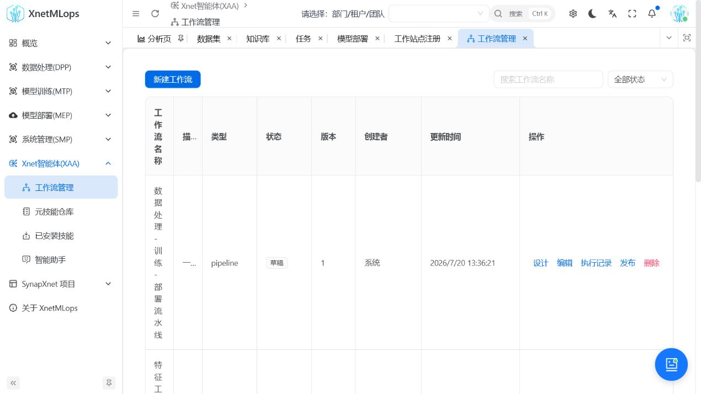
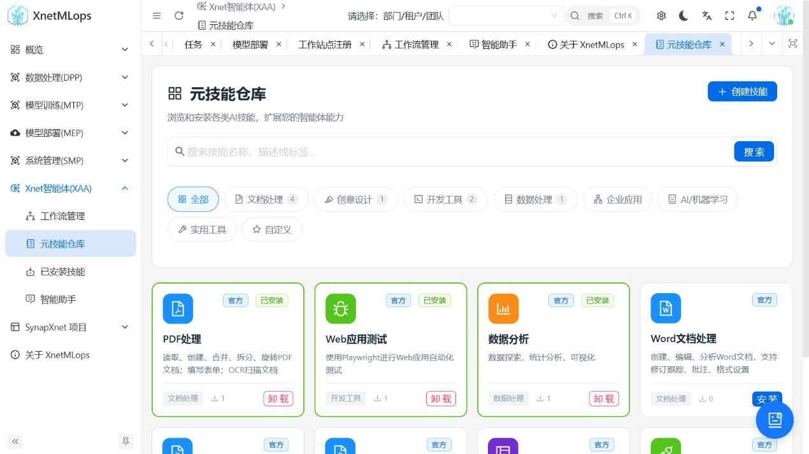
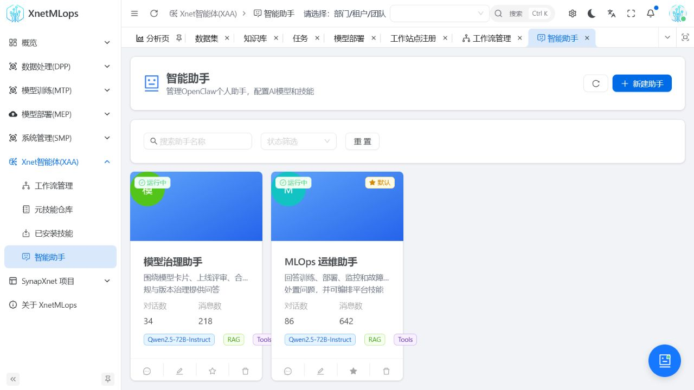
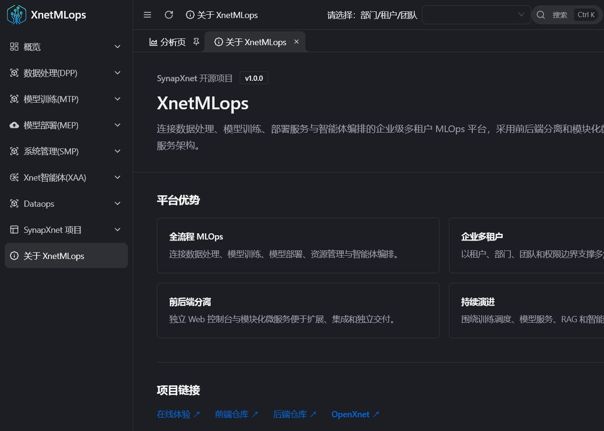
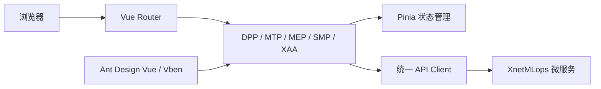

<div align="center">

# XnetMLops Web

**XnetMLops 模型工程与智能体平台的 Web 控制台**

[](https://github.com/synapxnet/XnetMLops-web/releases/tag/v1.3.0) [](https://vuejs.org/) [](https://www.typescriptlang.org/) [](./LICENSE)

[在线体验](https://goai.xnetmlops.synapxnet.online) · [后端仓库 XnetMLops](https://github.com/synapxnet/XnetMLops/tree/v1.3.0) · [OpenXnet 开源社区](https://openxnet.synapxnet.com) · [查看许可](./LICENSE)

</div>

## GOAI v1.3.0 发布与下载

当前为 `GOAI-Competition` 分支，**v1.3.0 源码版已正式发布**。发布标签固定代码版本，后续 README 完善不会改变已发布代码和附件。

**[发布说明](https://github.com/synapxnet/XnetMLops-web/releases/tag/v1.3.0) · [下载源码 ZIP](https://github.com/synapxnet/XnetMLops-web/releases/download/v1.3.0/XnetMLops-web-v1.3.0-0a0ce65a-source.zip) · [v1.3.0 固定源码](https://github.com/synapxnet/XnetMLops-web/tree/v1.3.0) · [构建与交付文档](https://github.com/synapxnet/XnetMLops-web/blob/0a0ce65a4b654b372355800057f30e8fc551b883/docs/GOAI-FINALS-V1.3.0-SOURCE-DELIVERY.md)**

[配套后端 v1.3.0](https://github.com/synapxnet/XnetMLops/releases/tag/v1.3.0) · [OpenXnet v1.3.0](https://github.com/synapxnet/OpenXnet/releases/tag/v1.3.0)

GOAI 版包含驻场 Agent 面板、统一登录与导航、模型证据、工作流输入输出契约、下载进度与部署能力状态。产品入口为 `apps/web-antd`。

[驻场 Agent 运行时](https://github.com/synapxnet/OpenXnet/tree/c841ef841da8477fc312e27cd390aecac8ed2d7e/services/platform-resident-agent)作为独立平台服务运行，与 OpenXnet AgentTeams 协同，需要配置平台身份、模型服务与委派权限；已有智能助手不代表驻场运行时已经配置完成。

本次源码交付验证：生产构建 11/11、31 项定向回归与 69 个页面模板检查通过；未执行全量 vue-tsc、真实后端集成及逐页线上验收。 发布版本不代表重新部署线上，也不等于生产认证；环境配置与限制以交付文档为准。

> **下方均为历史界面截图：** 保留作为展示参考，不代表 v1.3.0 最新 UI 验收结果，也不是实时治理执行证据。



## 页面预览

### DPP 数据处理

| 数据集管理 | RAG 知识库 |
| --- | --- |
|  |  |

### MTP 模型训练与 MEP 模型部署

| 训练任务 | 模型部署 |
| --- | --- |
|  |  |

### SMP 系统管理与 XAA 智能体

| 工作站资源 | 智能体工作流 |
| --- | --- |
|  |  |

| 元技能仓库 | 智能助手 |
| --- | --- |
|  |  |

### 演示入口与项目信息

| 演示登录 | 关于项目 |
| --- | --- |
|  |  |

## 项目简介

XnetMLops Web 是由 **SynapXnet 团队**开源的模型工程控制台，为数据工程师、算法工程师、平台管理员和 AI 应用开发者提供统一工作区。界面覆盖数据处理、训练任务、模型服务、基础资源和智能体编排，让模型从实验走向服务的过程更可见、可控和可复用。

本仓库是平台前端，与 [XnetMLops](https://github.com/synapxnet/XnetMLops/tree/v1.3.0) 后端仓库共同组成企业级、多租户、前后端分离系统。项目基于 Vue 3、TypeScript、Vite、Ant Design Vue，并采用 [Vue Vben Admin 框架](https://github.com/vbenjs/vue-vben-admin) 构建，通过模块化路由组织 DPP、MTP、MEP、SMP、XAA 五个业务域。

## 项目优势

- **企业多租户**：以租户、部门、团队和权限边界支撑不同角色协同研发。
- **前后端分离**：控制台与微服务独立发布，方便企业集成与按模块扩展。
- **全流程闭环**：连接数据处理、定时训练、模型部署、推理服务与智能体编排。
- **持续更新**：SynapXnet 团队会持续完善训练、部署、RAG、智能体体验与文档。

## 功能模块

| 模块 | 主要功能 |
| --- | --- |
| DPP 数据处理 | 数据集管理、预处理、特征工程、定时管道、RAG 知识库与 Jenkins 任务 |
| MTP 模型训练 | 算法与训练任务管理，数据集、变量和参数配置，立即/定时训练，状态、日志和产物查看 |
| MEP 模型部署 | 模型部署、LLM 服务、API 密钥、部署节点、运行日志与 OpenClaw 实例 |
| SMP 系统管理 | 租户、部门、团队、数据源、存储桶、工作站、Hadoop、Jenkins、Harbor、镜像与算子资源 |
| XAA 智能体 | 助手、会话、消息、可视化工作流、技能与跨 DPP/MTP/MEP 能力编排 |
| 概览与认证 | 平台指标、工作台、演示登录和访问控制入口 |

## 前端架构



## 技术栈

- Vue 3 + TypeScript
- Vite + Turbo
- Ant Design Vue + Vben Admin
- Pinia + Vue Router
- pnpm 9.15.7

## 开发与构建（v1.3.0）

使用 Node.js **20.10+**、pnpm **9.15.7**，前端为 Vue 3、TypeScript、Vite/Turbo 与 Ant Design Vue/Vben。实际产品入口是 `apps/web-antd`；`playground`、`web-ele` 和 `web-naive` 不是 MLOps 发布入口。

```bash
git clone --branch v1.3.0 --single-branch https://github.com/synapxnet/XnetMLops-web.git
cd XnetMLops-web
corepack enable
corepack prepare pnpm@9.15.7 --activate
pnpm install --frozen-lockfile
pnpm build:antd
```

静态产物位于 `apps/web-antd/dist`。若依赖安装时禁用了生命周期脚本，先执行 `pnpm -r --if-present run stub` 再构建。本地开发前，先将 `apps/web-antd/vite.config.mts` 代理目标改为自己的后端，再运行 `pnpm dev:antd`（配置端口 `5666`）。仓库代理目标是研发示例，不是公开演示地址。

部署时同时配置 `apps/web-antd/.env.production` 的 API 前缀与同源反向代理。当前线上 `_app.config.js` 只观察到 `VITE_GLOB_API_URL`，不能认为改这一项就能切换全部服务。后端通用 Nginx 模板使用不同的 `/api/<service>/` 形式，使用前须对齐前端路径重写与后端 Controller 前缀。前端配置不能公开访问令牌或模型密钥。

## 演示接入与 API 路由

- GOAI 演示入口：<https://goai.xnetmlops.synapxnet.online/#/auth/login>。
- 公开演示手机号：**`17870171303`**；验证码：**`000000`**（仅限演示环境，已由项目方确认并授权公开）。登录方式为 **11 位手机号 + 6 位验证码**，提交到 `POST /api/auth/login`；不是密码登录，也不是 OpenXnet AgentTeams 的演示访问码输入框。
- 2026-09-18 只读核验：入口 HTTP 200、标题 `XnetMLops`；登录后读取 `/api/resident/v1/status` 返回 `platform=mlops`、`agentId=agt-mlops-resident-v130`，未登录读取为 401。该检查证明平台身份和访问控制，不代表重新完成全业务流程验收。

Web API 均使用演示入口的同源地址：

| 服务 | 前端 API base | 后端服务端口 |
| --- | --- | --- |
| Auth | `/api` | `8181` |
| DPP | `/dpp` | `8182` |
| MTP | `/mtp` | `8183` |
| MEP | `/mep` | `8184` |
| SMP | `/smp` | `8185` |
| XAA | `/xaa` | `8186` |


驻场 API base 为 `/api/resident/v1`。平台登录凭据、驻场 Agent 的模型服务密钥、OpenXnet AgentTeams 演示访问码是三类不同配置；业务操作仍受租户/团队权限和执行审批约束。

## SynapXnet 开源生态

本项目属于 SynapXnet 开源项目矩阵。访问 [OpenXnet](https://openxnet.synapxnet.com) 获取更多团队项目与社区信息。

## 参与贡献

欢迎提交 Issue 与 Pull Request。新增模型工程页面时请复用现有路由、权限、状态管理和请求层约定，并确保长任务状态与错误信息清晰可见。

## 开源许可

本项目基于 [MIT License](./LICENSE) 开源。前端采用 [Vue Vben Admin 框架](https://github.com/vbenjs/vue-vben-admin)，并依法保留上游项目的 MIT 版权与许可声明。
