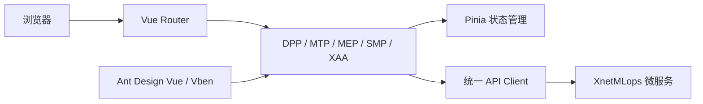

<div align="center">

[简体中文](./README.md) | [English](./README.en-US.md) | [日本語](./README.ja-JP.md)

# XnetMLops Web

**XnetMLops 模型工程与智能体平台的 Web 控制台**

[](https://www.xnetmlops.synapxnet.cn) [](https://vuejs.org/) [](https://www.typescriptlang.org/) [](./LICENSE)

[在线体验](https://www.xnetmlops.synapxnet.cn) · [后端仓库 XnetMLops](https://github.com/synapxnet/XnetMLops) · [OpenXnet 开源社区](https://openxnet.synapxnet.com) · [查看许可](./LICENSE)

</div>


## 页面预览

### DPP 数据处理

| 数据集管理 | RAG 知识库 |
| --- | --- |
|  |  |

### MTP 模型训练与 MEP 模型部署

| 训练任务 | 模型部署 |
| --- | --- |
|  |  |

### SMP 系统管理与 XAA 智能体

| 工作站资源 | 智能体工作流 |
| --- | --- |
|  |  |

| 元技能仓库 | 智能助手 |
| --- | --- |
|  |  |

### 演示入口与项目信息

| 演示登录 | 关于项目 |
| --- | --- |
|  |  |

## 项目简介

XnetMLops Web 是由 **SynapXnet 团队**开源的模型工程控制台，为数据工程师、算法工程师、平台管理员和 AI 应用开发者提供统一工作区。界面覆盖数据处理、训练任务、模型服务、基础资源和智能体编排，让模型从实验走向服务的过程更可见、可控和可复用。

本仓库是平台前端，与 [XnetMLops](https://github.com/synapxnet/XnetMLops) 后端仓库共同组成企业级、多租户、前后端分离系统。项目基于 Vue 3、TypeScript、Vite、Ant Design Vue，并采用 [Vue Vben Admin 框架](https://github.com/vbenjs/vue-vben-admin) 构建，通过模块化路由组织 DPP、MTP、MEP、SMP、XAA 五个业务域。

## 项目优势

- **企业多租户**：以租户、部门、团队和权限边界支撑不同角色协同研发。
- **前后端分离**：控制台与微服务独立发布，方便企业集成与按模块扩展。
- **全流程闭环**：连接数据处理、定时训练、模型部署、推理服务与智能体编排。
- **持续更新**：SynapXnet 团队会持续完善训练、部署、RAG、智能体体验与文档。

## 功能模块

| 模块 | 主要功能 |
| --- | --- |
| DPP 数据处理 | 数据集管理、预处理、特征工程、定时管道、RAG 知识库与 Jenkins 任务 |
| MTP 模型训练 | 算法与训练任务管理，数据集、变量和参数配置，立即/定时训练，状态、日志和产物查看 |
| MEP 模型部署 | 模型部署、LLM 服务、API 密钥、部署节点、运行日志与 OpenClaw 实例 |
| SMP 系统管理 | 租户、部门、团队、数据源、存储桶、工作站、Hadoop、Jenkins、Harbor、镜像与算子资源 |
| XAA 智能体 | 助手、会话、消息、可视化工作流、技能与跨 DPP/MTP/MEP 能力编排 |
| 概览与认证 | 平台指标、工作台、演示登录和访问控制入口 |

## 前端架构



## 技术栈

- Vue 3 + TypeScript
- Vite + Turbo
- Ant Design Vue + Vben Admin
- Pinia + Vue Router
- pnpm 9.15.7

## 快速开始

### 环境要求

- Node.js 20+
- pnpm 9.15.7

### 本地开发

```bash
corepack enable
pnpm install
pnpm dev:antd
```

### 生产构建

```bash
pnpm build:antd
```

部署前请根据目标环境检查 `apps/web-antd` 下的环境变量和 API 地址配置。不要将真实密钥、生产令牌或服务器凭据提交到仓库。

## 在线体验

- 访问地址：<https://www.xnetmlops.synapxnet.cn>
- 演示手机号：`17870171303`
- 演示验证码：`000000`

固定验证码仅用于公开演示。生产部署应接入安全的身份认证与验证码服务。

## SynapXnet 开源生态

本项目属于 SynapXnet 开源项目矩阵。访问 [OpenXnet](https://openxnet.synapxnet.com) 获取更多团队项目与社区信息。

## 参与贡献

欢迎提交 Issue 与 Pull Request。新增模型工程页面时请复用现有路由、权限、状态管理和请求层约定，并确保长任务状态与错误信息清晰可见。

## 开源许可

本项目基于 [MIT License](./LICENSE) 开源。前端采用 [Vue Vben Admin 框架](https://github.com/vbenjs/vue-vben-admin)，并依法保留上游项目的 MIT 版权与许可声明。
